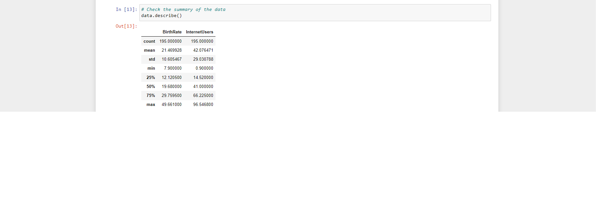
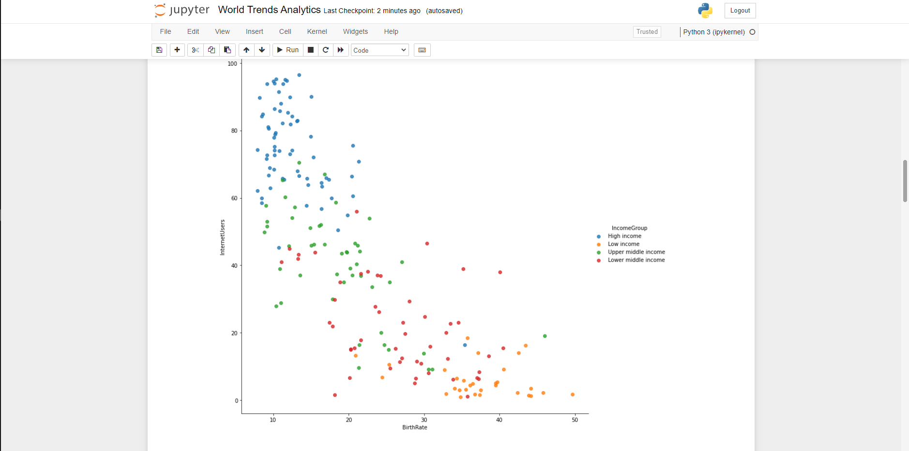
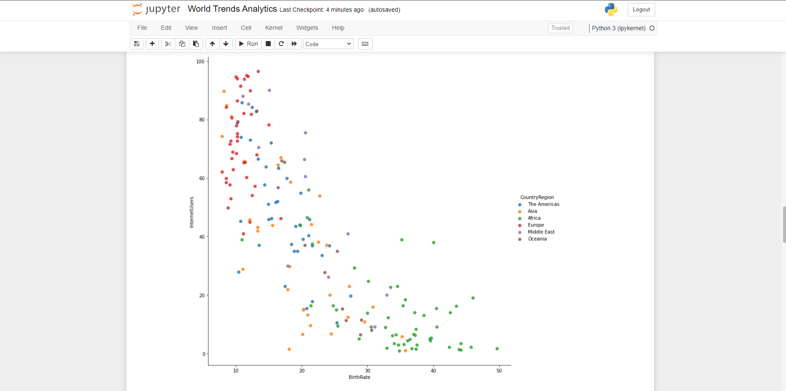
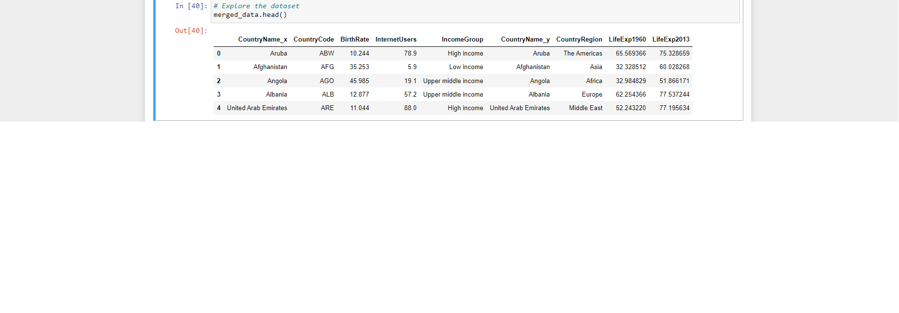
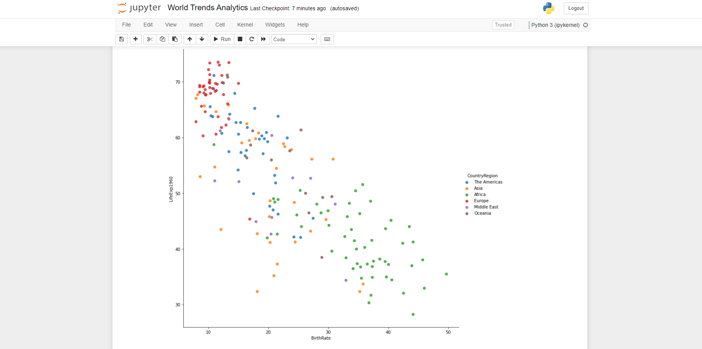

World Trends Analysis Project
 
 
1. About the data: 

The project provided by  . The dataset contains the data of 196 Countries along with their Country Code, 	Birth rate,	 Internet users, 	Income Group. Some data has been provided in a CSV file, some in Python lists. The CSV file contains combined data for both years 1960 and 2013. 

2. Goal: 

Using Python to perform data manipulation and analyze the world trends in different time periods based off the historical data given.

3. What are the task given?: 

Through the data given, I'm looking for:

Task 1: A  scatterplot illustrating Birth Rate and Internet Usage statistics by Country.

The scatterplot need to be categorised by Countries’ Income Groups

Task 2:

A scatterplot depicting Life Expectancy (y-axis) and Fertility Rate (x-axis) statistics by Country.

The scatterplot need to be categrorised by Countries Regions.

Task 3:

A visualization based off the data for 2 years: 1960 and 2013.

Task 4: An insights into how the periods compare.

 

 

 
 

 
 
Summary Of Data:
 
 

A scatterplot illustrating Birth Rate and Internet Usage statistics by Country. The scatterplot is categorised by Countries' Income Groups.
 
 

 
 
Task 2:
 
 
A second scatterplot also illustrating Birth Rate and Internet Usage statistics by Country.
 
 
This time, the scatterplot are categorised by Countries’ Regions.
 
 
 
Summary Of Data:
 
 

 
 
Scatterplot: 
 
 

 
  
 
 
Task 3:

A  scatterplot depicting Life Expectancy (y-axis) and Fertility Rate (x-axis) statistics by Country.
 
 
The scatterplot is categorised by Countries Regions.
 
 
The data is provided for 2 years: 1960 and 2013 and there's a need to produce a visualisation for each of these years.
 
 
 
Summary Of Data:
 
 

 
 
Scatterplot
 
 

