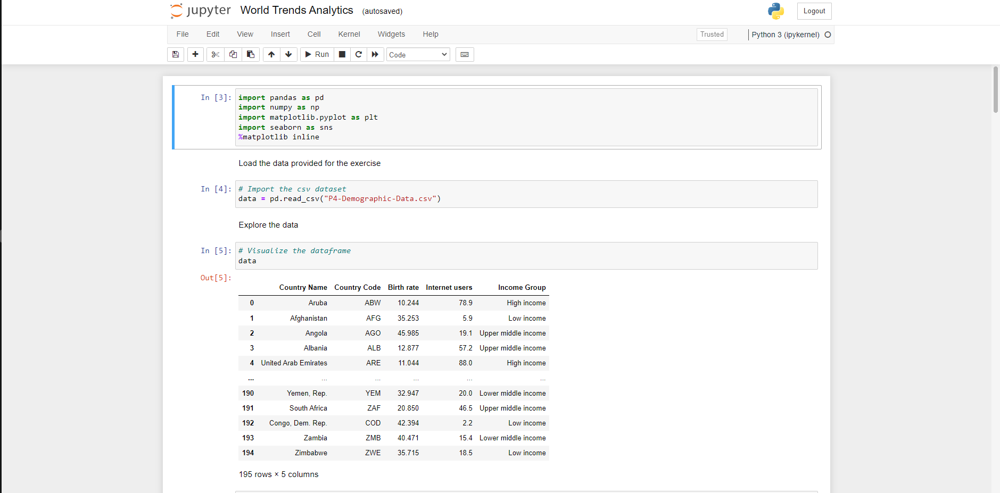

World Trends Analysis Project
 
 
1. About the data: 

The data 

3. What are the task given?: 

Through the data given, I'm looking for:

Task 1: A  scatterplot illustrating Birth Rate and Internet Usage statistics by Country.

The scatterplot need to be categorised by Countries’ Income Groups

Task 2:

A scatterplot depicting Life Expectancy (y-axis) and Fertility Rate (x-axis) statistics by Country.

The scatterplot need to be categrorised by Countries Regions.

Task 3:

A visualization based off the data for 2 years: 1960 and 2013.

Some data has been provided in a CSV file, some in Python lists. The CSV file contains combined data for both years. All data manipulations have to be performed in Python (not in Excel) because this project can be audited at the later stage.

Task 4: An insights into how the periods compare.

 

 

Dataset:
 
 

 
 
Summary Of Data:
 
 

A scatterplot illustrating Birth Rate and Internet Usage statistics by Country. The scatterplot is categorised by Countries' Income Groups.
 
 

 
 
Task 2:
 
 
A second scatterplot also illustrating Birth Rate and Internet Usage statistics by Country.
 
 
This time, the scatterplot are categorised by Countries’ Regions.
 
 
 
Summary Of Data:
 
 

 
 
Scatterplot: 
 
 

 
  
 
 
A  scatterplot depicting Life Expectancy (y-axis) and Fertility Rate (x-axis) statistics by Country.
 
 
The scatterplot is categorised by Countries Regions.
 
 
The data is provided for 2 years: 1960 and 2013 and there's a need to produce a visualisation for each of these years.
 
 

 
 
Summary Of Data:
 
 

 
 
Scatterplot
 
 

